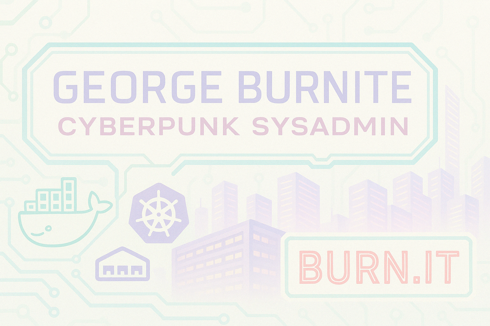

<p align="center">
  
</p>


---

# ⚡ NeuroDevOps

**NeuroDevOps** is an experimental, self-improving infrastructure automation system. Built on a foundation of Ansible, Docker, and AI, it aims to proactively optimize and maintain complex environments by analyzing system reports, detecting inefficiencies, and proposing or applying improvements autonomously.

---

## 🔭 Vision

Imagine a DevOps pipeline that doesn't just automate — it *thinks*. NeuroDevOps is a containerized AI-driven platform designed to:
- Continuously scan, report, and analyze your infrastructure.
- Suggest optimizations or fixes in real time.
- Learn from human-approved feedback and improve future recommendations.

---

## 🧰 Features

- 🧠 **AI Feedback Loop** — Uses LLMs (e.g. Mistral) with RAG for smart infrastructure suggestions.
- 🐳 **Containerized Architecture** — Modular containers for each core service.
- 📡 **Ansible Automation** — Declarative automation of diagnostics and data collection.
- 📊 **Dynamic Report Generation** — PDF/HTML reports built from real-time data.
- 🌐 **Dashboard UI (planned)** — Review AI suggestions, logs, and changes in one place.

---

## 🚀 Getting Started

```bash
# Clone the repo
git clone https://github.com/gjb1088/NeuroDevOps.git
cd NeuroDevOps

# Copy and customize your env variables
cp config/.env.example .env

# Fire up the stack
docker-compose up -d
```

---

## 📁 Repo Structure

```
├── ansible/              # Playbooks and roles
├── ai-engine/            # Prompt logic and model config
├── docker/               # Dockerfiles and entrypoints
├── docs/                 # Architecture diagrams, documentation, and banner
│   └── assets/           # Visual assets like banners, diagrams
├── config/               # Environment and system settings
├── scripts/              # Utility and automation scripts
├── docker-compose.yml    # Stack orchestrator
└── README.md             # You’re here!
```

---

## 🧪 Future Enhancements

- 🔄 Prompt tuning based on AI feedback success
- 🖥️ Real-time diagnostics dashboard
- ⏱️ Event-driven automation triggers
- ☁️ Cloud API integrations (Azure, AWS, GCP)

---

## 🔐 Security

⚠️ This project is experimental and not yet hardened for production use. Use with caution in sensitive environments.

---

## 👨‍💻 Creator

**George Burnite**  
*Cyberpunk Sysadmin. Infrastructure Alchemist. Creator of Burn.IT.*

[](https://www.linkedin.com/in/georgeburnite/)
